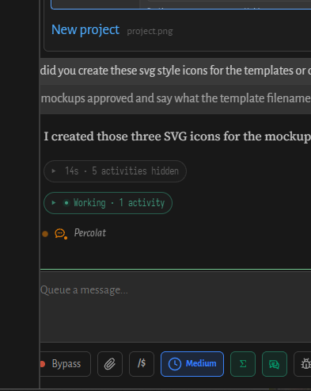

# Session pane develops a persistent offset across its components

Reported 2026-09-28: the session pane entered an offset/clipped layout that
affected all its components, not just an individual message or the composer.
The user has seen this once before. Toggling the sidebar did **not** clear it.
Restarting the server and the ensuing client reload restored normal layout.

The supplied 393×493 image shows the affected transcript, activity controls and
composer together. It is a crop of the failing view, not evidence of the full
browser viewport dimensions:

The triggering action, browser/device, deployed revision, zoom and pane state
are not yet established. Recovery combined a server restart and client reload;
it does not establish that server state caused the defect or that restarting
the server was necessary. Reload alone has not been tested independently.

This is a capture-only intake requested alongside unrelated template work.
The report and screenshot establish an observed failure; no reproduction or
root cause has been demonstrated against the current checkout. No production
layout change was made for this report.

## Investigation and closure

The violated expectation is that the transcript, activity controls and composer
share the correct session-pane geometry through sidebar/pane changes and
reconnects. Inspect their common layout ancestor and viewport/scroll state
before adding offsets to individual children.

On recurrence, capture bounding rectangles and computed transforms/margins for
the common session container, sidebar and composer, document horizontal scroll
and visual-viewport offsets, and record open panes and browser zoom. Test
sidebar toggle, viewport resize, client reload and server restart separately
to distinguish which transition clears the state. Do not restart the shared
server during investigation without the user's explicit instruction.

Close after reproducing the offset, fixing its shared geometry/state owner,
and verifying the affected components together on desktop and phone, including
the triggering sequence and sidebar toggling without a reload.

Found 2026-09-28 from the user's second observed occurrence.
Contributing-model: 6-Astra.
